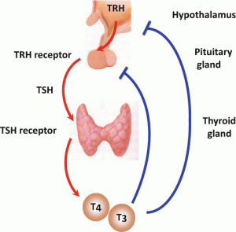

# week8_IP_Abel_Keya_Nairobi-Hospital-conducted-a-clinical-camp-to-test-for-hypothyroidism

**Problem statement:** Nairobi Hospital conducted a clinical camp to test for hypothyroidism. The data collected focused on Thyroid patients. Use the healthcare datasets provided to accomplish the following:  

Build a model that determines whether or not the patient's symptoms indicate that the patient has hypothyroid.

  
  

>
# Description
>
Part 1: Decision trees:
- For this section, you should build a model that makes the above prediction. You should not use individual decision trees, rather you should use at least 2 out of the 3 advanced models we have studied: Random forests, Ada boosted trees, and gradient boosted trees.
- Try and optimize each of the 2 models, making sure to document how you've set up your hyperparameters.
- Identify which of the 2 models you trust most, and use your model to determine which features are most impactful in influencing the prediction
Part 2: SVM:
- The project code applies Polynomial, linear and rbf kernel function to build the SVM model and then evaluate their performance and pick the kernel that performs the best. 
-  After getting your best performing kernel, use this kernel together with your tuned parameters and repeat the prediction but this time using additional features. Compare the model you've just created with the 2-features version. 
tuning of the parameters to improve the performance of your model. 
visualization of  the models created. 
>

>
# Context

>

# Data Features
Dataset
The [dataset](https://github.com/abel-keya/week_7_IP_Abel_Keya_hass_consulting-_company_with_quantile_and__regularization_based_regression_tech/blob/master/Independent%20Project%20Week%207%20-%20house_data.csv) has the following features:
**Dataset Columns**
* Age
* Sex
* on_thyroxine
* query_on_thyroxine
* on_antithyroid_medicationthyroid_surgery
* query_hypothyroid
* query_hyperthyroid
8 pregnant
* sick
* tumor
* lithium
* goitre
* TSH_measured
* TSH
* T3_measured
* T3
* TT4_measured
* TT4
>
# Requirements
* Anaconda installation
* Google colab
* Setup instruction
> * Save a copy of the notebook in your drive and open it to access.
# Technologies used

  

# Support
In case of any clarifications or suggestions with regards to this project email me at jumakeya@gmail.com

License
Copyright (c) 2020 **Abel Keya**
