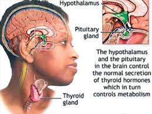
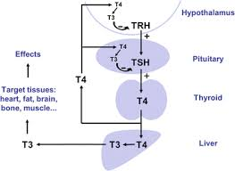

# week8_IP_Abel_Keya_Nairobi-Hospital-conducted-a-clinical-camp-to-test-for-hypothyroidism

**Problem statement:** Nairobi Hospital conducted a clinical camp to test for hypothyroidism. The data collected focused on Thyroid patients. Use the healthcare datasets provided to accomplish the following:  

Build a model that determines whether or not the patient's symptoms indicate that the patient has hypothyroid.
   
# Description

### Part 1: Decision trees:

- Boosted Decision Tree models that makes the above prediction. 
* Random forests,
* Ada boosted trees,
* gradient boosted trees.

- optimization of each of the the above models to Identify the best model, and used the best model to determine which features are most impactful in influencing the prediction

### Part 2: SVM:

- The project code applies Polynomial, linear and rbf kernel function to build the SVM model and then evaluates their performance and then  pick the kernel that performs the best. 
- the best kernel is  used with tuned parameters and  additional features. 
visualization of  the models created. 

# Context

   
### Hypothyroidism: (Underactive Thyroid)-Too Little Thyroid Hormone
Hypothyroidism is a condition in which the thyroid gland is not able to produce enough thyroid hormone. Since the main purpose of thyroid hormone is to "run the body's metabolism," it is understandable that people with this condition will have symptoms associated with a slow metabolism.
   

   
   

   
  
  
  

  

   
   Clinical procedure used for obtaining data:
 
 (https://www.youtube.com/watch?v=iIO09kGSRkI)
  
 (https://www.youtube.com/watch?v=XR4nOMp_bGA)

# Data Features
Dataset

The [dataset](https://github.com/abel-keya/week8_IP_Abel_Keya_Nairobi-Hospital-conducted-a-clinical-camp-to-test-for-hypothyroidism/blob/master/hypothyroid.csv) has the following features:

**Dataset Columns**
* Age, Sex, on_thyroxine, query_on_thyroxine,on_antithyroid_medicationthyroid_surgery,query_hypothyroid,query_hyperthyroid,pregnant,sick,tumor,lithium,goitre,TSH_measured,TSH,T3_measured,T3,TT4_measured,TT4

# Requirements
* Anaconda installation
* Google colab
* Setup instruction
> * Save a copy of the notebook in your drive and open it to access.
# Technologies used

  
 

# Support
In case of any clarifications or suggestions with regards to this project email me at jumakeya@gmail.com

License
Copyright (c) 2020 **Abel Keya**
